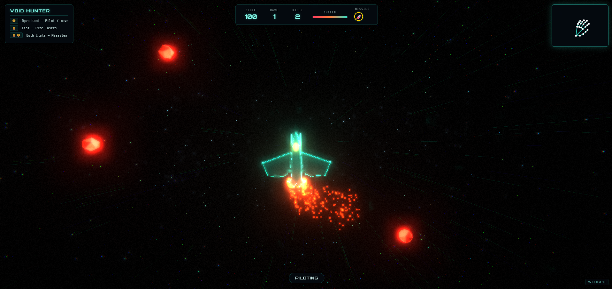

# Void Hunter

A browser-based space shooter game controlled entirely by **hand gestures** using your webcam — no keyboard, no mouse.

Built with MediaPipe Hands and HTML5 Canvas. No install needed, runs in the browser.

**Live demo:** https://Zahraaabidha.github.io/void-hunter/

---

## How to Play

| Gesture | Action |
|---|---|
| Move your hand | Aim / steer your ship |
| Pinch (thumb + index) | Fire |
| Fist | Shield / special |

Point your webcam at your hand and the game tracks it in real time.

---

## Enemy Types

- **Scout** — fast, low health
- **Cruiser** — slow, tanky
- **Swarm** — comes in groups

---

## Run Locally

Just open `index.html` in Chrome or Edge. Allow camera access when prompted.

---

## Tech

- MediaPipe Hands (gesture tracking)
- HTML5 Canvas (rendering)
- Vanilla JS — zero dependencies, single file
